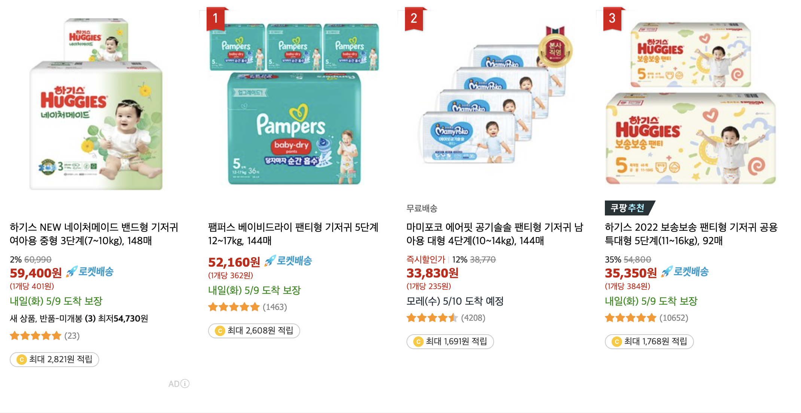

# 서비스 소개      

쿠팡의 창업자는 한국계 미국인인 Bom Kim 이다.

2010년 8월 오픈했으며, 2022년 국내 쇼핑몰 업체 거래액 및 이커머스 시장 점유율에서 네이버를 제치고 1위에 올라섰다

한국 법인 쿠팡 주식회사는 비상장 기업이지만, 본사인 미국 Coupang Inc.는 뉴욕증권거래소에 상장되어 있다.

현재 쿠팡은 온라인 종합 쇼핑몰 & 오픈마켓이라고 볼 수 있다. 스스로는 아이템 마켓이라 칭하고 있다.

2014년부터 익일 배송을 내세운 자체 배송 서비스 로켓배송을 도입했다.

쿠팡은 매출에서 직매입 비중이 높다. 즉, 물건 값이 바로 자기 매출이 되는 것이다. 반면 다른 업체들은 중개 거래가 대부분으로 매출이 수수료 매출이기 때문에 쿠팡과 다른 업체의 매출액을 바로 비교하는 것은 큰 의미가 없다.

<br>

# 서비스 분석

## ▶ 서비스 미션 & 비전 <br>

'쿠팡은 커머스의 미래를 만들어 가고 있습니다' 이라는 슬로건을 바탕으로 고객 감동 실현을 서비스의 최우선 미션으로 생각하고 실현하고 있다. 

또한 고객들이 "쿠팡 없이 그동안 어떻게 살았을까?" 하는 생각이 드는 서비스를 만들기 위해 노력하고 있다.

쿠팡은 커머스의 미래를 만들겠다는 쿠팡의 미션을 바탕으로 고객의 문제를 해결해 나가고, 전통적인 관념과 통념에 맞서며 실현가능한 한계를 뛰어넘으려고 하고 있다. (ex.로켓배송)

쿠팡은 철저한 ‘아마존’식 비즈니스를 통해 길을 찾았다. 강력한 기술을 기반으로 고객이 가장 불편해하는 모든 단점을 보완하는 한편 일종의 가두리 양식장 전략을 사용했다.

<br>

## ▶ 서비스 목표 & 전략 <br>

### 🔸 초창기 쿠팡의 목표  🔸

쿠팡 설립 초기인 약 2011년부터 쿠팡의 창립자인 김범석 대표는 공식 석상에서 “쿠팡의 목표는 한국의 아마존과 같은 기업이 되는 것”이라고 밝혔다.

그래서 초창기 쿠팡의 목표는 “꾸준한 성장을 통해 쿠팡을 미국 나스닥에 상장 시키겠다”라는 목표를 수차례 밝혀왔다. (현재 이 목표는 해결 되었다) <br>

### 🔸 현재 쿠팡의 목표  🔸

```
적자로 인한 부담, 수익구조 개선을 최우선 목표로!
```

쿠팡은 자연스럽게 브랜드가 알려지면 알려질수록 물류의 수요가 늘었고 그를 지탱해야 할 비용도 늘면서 큰 적자가 누적됐다. 

2022년 하반기 내부사정에 정통한 관계자에 따르면 쿠팡은 실제 흑전을 위한 재무구조 개선에 나선 것으로 파악된다. 성장률보다는 이익을 최우선 목표로 둬 본격적으로 체질 개선에 나설 것으로 보인다.

  <br>

```
커머스 사업과의 시너지를 꾀해 아마존형 비즈니스로!
```

이커머스(플랫폼)와 물류(로켓배송·물류센터) 그리고 콘텐츠(OTT), 금융까지 연결하는 한국형 아마존 비즈니스의 완성을 기대하고 있다. 최근에는 금융업까지 발을 들이고 있다. 

금융업에 발을 들이는 이유로는 로켓배송’에 필요한 물류 비용을 절감하고 수직 계열화를 통해 배송 효율을 극대화할 것으로 전망된다. 특히 쿠팡은 최근에 직매입뿐만 아니라 입점 판매자 상품까지 로켓배송으로 배송하는 ‘로켓그로스’ 서비스를 출시했고, 지역 곳곳에 새로운 대형 물류센터 건립이 예정된 터라 상품 배송을 담당하는 쿠팡 친구(배송원)와 쿠팡 카(배송 차량) 등 물류 인프라가 더욱 필요한 상황이다.

이 과정에서 외부 금융사를 통하지 않음으로써 파생될 비용 절감 효과도 기대된다. 일례로 쿠팡의 물류 자회사 쿠팡로지스틱스서비스는 지난달 현대캐피탈과 약 196억 원 규모의 차량 리스 계약을 체결했는데 쿠팡파이낸셜의 자동차 할부금융 사업 규모가 커지면 이 같은 비용을 계열사 내에서 부분적으로 해결할 것으로 보인다.


  <br>

```
점유율 전쟁, 30%를 향해서!
```

쿠팡의 목표는 물류 인프라를 활용한 배송 확대로 ‘점유율 30%’ 고지를 넘기 위함으로 풀이된다. 이커머스 업계에서는 점유율 30%를 기준이자 전환점으로 보고 있다. 

<br>

## ▶ 서비스 구조

### 🔹 서비스 주체 🔹ㄴ
구매자, 판매자, 서비스 운영자, 물류 관계자

### 🔹 서비스 현황 🔹

```
쿠팡의 경우 효율성이 최대 강점이다.
```
첫번째로 쿠팡의 정기배송 서비스는 배송 받을 날짜와 배송 주기(월 단위)를 선택할 수 있어 원하는 날짜에 로켓배송으로 상품을 받아볼 수 있다.

두번째로 손쉽게 제품 단계 변경을 할 수 있다. 예를 들어 아기가 성장하면 분유나 기저귀 등을 성장 개월 수에 따라 바꿔야 하는데 이런 단계 변경이 편리하다. 본인의 정기 배송 상품 목록에서 더 높은 단계의 기저귀, 같은 상품인데 사이즈만 더 큰 상품 등이 자동으로 제시되는 것을 확인할 수 있다. 이는 국내에서 유일하게 쿠팡만이 제공하는 서비스로 UX(사용자 경험)에 대한 연구를 기반으로 상품 전체를 구조화해 목록화한 데이터 관리 기술 및 고객의 의도를 미리 짐작해 원하는 결과를 보여주는 검색 엔진 기술 등이 적용됐다.

마지막으로 추가 할인 혜택이다. 정기배송 SAVE 상품을 1가지 신청하면 쿠팡가의 5% 할인, 3가지 이상의 서로 다른 SAVE 상품을 동일한 날에 받도록 신청하면 모든 정기배송 상품에 10%를 추가로 할인해 준다. 

```
쿠팡은 아이템 마켓이다.
```
한정된 시간 안에 할인율을 제공하는 딜 형태의 소셜커머스가 아니라 쿠팡에 등록한 사람이면 누구나 자유롭게 입점하여 물건을 팔 수 있는 마켓 플레이스다. 소셜커머스와 가장 큰 차이점은 바로 수수료이다. 평균 20%가 넘는 소셜커머스의 수수료가 아닌 5~10%, 국내 최저 수수료를 제공하게 되었다.

쿠팡은 크게 보면 오픈마켓 범주에 들지만 기존 오픈마켓과는 차별화된 ‘아이템 마켓’이다. 여러 판매자가 파는 같은 상품을 병렬로 나열해 보여주는 오픈마켓이 아니라 개별 상품의 옵션, 즉, 아이템별로 판매 페이지를 보여주는 방식이라는 뜻이다.

```
타 유통사 대비 광고상품 아니더라도 상위 노출 가능
```
쿠팡은 가격 경쟁력과 제품 경쟁력을 갖추면 상위에 노출될 수 있다. 검색 시 상위에 노출될 수 있는 방법은 검색 랭킹을 올리는 법에서 확인할 수 있다. 만약 상품이 온라인 최저가라면 ‘쿠런티’를 부착해 판매할 수 있다. 쿠런티는 판매자가 온라인 최저가 등록을 하면 쿠팡이 ‘쿠런티’ 마크를 달아 노출시키는 최저가 온라인 보상 프로그램이다. 

```
직접 만들어본 쿠팡 구조
```
  <br>

### 🔹 수익 모델 🔹
상품 판매 수수료, 광고 수익, 유료 멤버십 요금

<br>

 # 서비스 문제점 및 개선방향

## ◼ 비즈니스 문제점 ◼
```
아마존식 비즈니스? 한국의 아마존 쿠팡?
```
  <br>
아마존은 2020년 총 68억7000만달러(한화 7조6000억원)를 벌어들였는데, 이중 50%가 넘는 35억6000만달러(한화 4조원)가 AWS 사업부문에서 창출됐다. AWS, 북미, 해외 등 아마존의 3개 사업부문 중 클라우드 서비스 사업에서 가장 많은 돈을 벌어들였다.

그러나 쿠팡의 경우 현재까지 유일한 희망은 이커머스 사업이다. 이커머스 사업에서 수익을 내지 못 하는 이상 회사의 지속가능한 경영에 의구심이 생길 수밖에 없다. 쿠팡이츠, 쿠팡플레이, 풀필먼트 서비스 등 다양한 사업들에 진출하고는 있지만 아직 큰 규모의 수익을 기대하기는 어려운 게 사실이다.

```
아이템 위너 정책 논란
```
아이템 위너는 동일 상품을 판매하는 사람이 있으면, 가장 좋은 조건에 파는 사람에게 그 상품 판매 페이지 및 리뷰 등을 통째로 넘겨주는 정책이다.그래서 판매자들의 저작권을 침해한다는 비판이 있다. (아니 다 떠나서 리뷰를 넘겨주는 건 좀..)

```
쿠팡 파트너스 관리의 문제
```
유튜브의 커뮤니티 등지에서 활동하는 쿠팡 파트너스들의 행태에 대한 비판이 많다. 이들 채널은 사람들에게 어그로가 끌릴 만 한 이슈나 글, 만화 등의 링크를 걸어 놓고 내용의 일부나 제목만 보여준 뒤 나머지 내용을 보기 위해서는 또 링크된 쿠팡 사이트에 접속하여 광고를 보고 나와야 하게 만들어져 있다.

```
쿠팡 짝퉁 문제
```
쿠팡에 짝퉁 제품이 많다.

```
쿠팡 마켓플레이스 입점자들 불만
```
타 플랫폼 대비 정산이 느려서 판매할 수록 돈이 더 든다는 것은 꾸준히 문제로 제기되었으나 아직도 해결이 제대로 안됐다고 한다. 마켓플레이스는 3주 정도 걸리며, 로켓배송은 약 2달도 자금이 묶인다. 

쿠팡은 AI서비스를 통해 자동적으로 최저가를 따라가는데 가격을 내리는 대응은 빠르지만 올릴때는 직접 요청을 해서 가격을 올려야 합니다. 

마켓플레이스와 로켓 배송 두 가지를 동시에 사용할 수 없습니다. 로켓배송이 쿠팡 입장에서 수수료를 더 많이 가져갈 수 있기 때문에 로켓배송으로 상품을 입점하면 마켓플레이스에는 올리지 못하게 판매중지를 해버립니다. 

## ◻ 서비스 문제점 (VOC모음집) ◻

```
상품 스크롤시 원하지 않는 상세페이지로 유입 
```
상품 스크롤 내리다 보면 터치가 아닌대도 상품 페이지로 들어가지는 경우가 있다는 VOC가 많이 보인다. 

```
로켓프레시 정책 
```
로켓프레시 박스 쓰기 싫은데 기본으로 설정이 되어있으며, 이를 바꾸고 싶으면 이번만 봉투로 받기를 눌러야 하고 15,000원 이상 사야 배송이 가능하다. 쿠팡와우 멤버십 결제 안하면 로켓프레시 안된다.

```
배송 문제
```
로켓와우랑 로켓배송을 동시에 시키면 같이 온다. 일정에 맞춰 주문했는데 주문/결제창에 따로 받기를 클릭해야 한다.

```
검색 기능 직구 문제
```
직구 배제 하고 싶은데 검색상품에 직구가 포함된다. 필터링에서 직구 포함하지 않는 법 찾아보았지만 따로 나오지 않는 거 같다. 

```
광고문제
```
앱을 키면 광고, 검색창에도 광고, 검색하고 나서도 광고, 상품 페이지도 광고, 구매 창도 광고, 모든 페이지에 광고가 같이 있다. 

```
자주 산 상품 노출 문제
```
한 구매자가 바퀴약을 구매한 이후 자주 산 상품 해충사진 담긴 바퀴약 계속 떠있는거 불쾌한데 소비자가 자주 산 상품 커스텀이 안되고 고객센터에 전화해서 문의를 해야만 대응이 가능하다.

```
핸드폰 인증 문제
```
해외 인증이 불편하다는 VOC가 있으며, 핸드폰 인증 문제 중 '어떤 물건을 마지막으로 샀는가', '정기배송건이있는가' 이런 질문이 기억이 안나서 인증이 안된다고 신분증 인증이 있었으면 좋겠다고 한다. 

```
검색 키워드 문제
```
예를들어 후드집업을 검색했는데 상단부에 나오는게 후드도 아니고 집업도 아닌 이상한 키워드가 나오는 경우가 종종 있다고 한다. (근데 이건 마켓컬리도 그렇고 검색 알고리즘 문제 같음..)

```
찜 리스트에 폴더 기능 추가건의
```
찜 리스트의 상품 메뉴에 폴더 기능이 있으면 좋겠다. 찜 한 상품이 점점 많아질수록 원하는 상품을 찾기 어렵다.

```
광고와 광고 아닌 상품에 대한 구별 
```
광고 물품과 검색 물품 사이에 뚜렷한 구분이 있었으면 좋겠다. 광고 표시가 작고 흐릿해 직관적인 식별이 어렵고, 검색어와 유사한 상품이 광고로 뜨지만, 정작 내가 검색어로 입력한 기능이 없거나 미달인 상품이 많아서 물품을 잘못 구매하도록 유도한다.

```
가로 모드 문제
```
태블릿으로 볼 때는 가로모드가 아니면 앱 사용하기 불편해서 쿠팡을 잘 안쓰게 된다. 아이패드가 아직 지원이 안 되는 거 같다.

```
새로운 상품 정렬 문제
```
그런데 홈 화면에서 특정 물품 터치했다가 뒤로가기 눌렀을 때 기존에 있던 상품들이 자동으로 죄다 바뀌어서, 바뀌기 전 눈여겨보았던 아이템을 확인 못 하고 자꾸 놓치게 되는게 너무 열받는다.
+ 나중에는 제가 선택한 상품들만 나열해서 비교하는 기능도 있으면 좋겠다. ex 애플에 상품 비교하기

```
다크모드 지원
```
쿠팡은 다크모드가 안된다.

## 🔻 UI디자인 🔻
쿠팡은 UI디자인이 번잡하다는 의견이 5년내내 나오고 있다.
<br>

# 서비스 개선안 (쇼핑 경험)
물류시스템, 아이템마켓(아이템위너)등의 비즈니스 문제는 서비스 기획 관점에서 해결하기 어렵다. 그래서 서비스 관점의 문제들 해결책을 생각해 보았다.

## 쿠팡 파트너스 관리
비즈니스 중에서도 이 부분은 개선점을 도출 할 수 있을 거 같은데 현재 쿠팡 파트너스 가입 및 활동 절차는 매우 간단하다. 쿠팡 파트너스 회원 가입 이후 쿠팡 파트너스 상품 중 원하는 걸 링크 생성하여 뿌린 후 다른 사람이 그 링크를 통해 구매를 하면 일정 부분 수수료를 받는 시스템이다.<br>

 <br>

그러다보니 무분별한 광고, 특히 낚시성 게시글 문제가 심하게 일어나게 되는데 수익금 배분 페이지에 이런 무분별한 남용과 체계적인 관리에 대한 내용도 추가되어야 할 필요가 있다. 쿠팡 입장에서는 무분별한 광고가 사람들에게 노출되는데 도움이 될 수도 있지만 쿠팡 서비스를 분석하며 느낀 것은 광고로 인해 반감이 생길정도로 심각하여 개선이 필요하다.

## 상품 노출 서비스 개선
상품 구매시, 자주 산 상품이 노출되는 데 원하지 않는 상품인대도 노출이 된 케이스가 있다. 이럴 경우 소비자가 직접 삭제가 불가능한데 자주 산 상품이나 즐겨찾는 상품에 관해서 삭제가 편하게 바꾸면 좋을 거 같다. 같은 위계에 있는 최근 본 상품은 소비자가 직접 삭제가 가능한데 자주 산 상품은 왜 삭제가 안되는지 모르겠다.

그리고 홈화면에서 상품 클릭 후 뒤로가기를 누르면 상품 정렬이 바뀌어 있는 것을 확인했다. 뒤로가기의 기능이 다시 이전 서비스를 보고 싶어서 가는 것인데, 화면이 바뀌는 것은 기능의 취지에서 벗어난다고 생각한다. 이부분도 사용자의 쇼핑 경험 측면에서 개선이 필요하다. 

## 찜리스트 폴더화
쿠팡은 급하게 한 제품을 로켓배송할 때도 사용하지만 생필품을 구매할 때도 많이 쓴다. 특히 요즘에는 대형마트보다 쿠팡, SSG 같은 곳에서 장보는 것이 많이 보편화 되어있기 때문에 많은 물품을 효율적으로 관리하는 것이 중요하다.찜리스트를 폴더화 시켜서 종류별로 관리할 수 있으면 쇼핑할 때 큰 도움이 될 거 같다. (또한 오프라인에서는 못하는 온라인만의 장점으로도 발전할 수 있다.)

## 광고와 광고가 아닌 상품
 <br> 네이버
 <br> 쿠팡  <br> <br> 

네이버를 보면 맛집 리스트를 찾을 때 광고 옆에는 저렇게 표시가 된다. 그런데 쿠팡은 이 상품이 광고상품인지 아닌지 구별이 어렵다. 이런 형태가 광고주 입장에서는 좋을 수 있는데 소비자 입장에서는 쇼핑 경험을 해친다고 생각한다.

## 로켓배송, 로켓와우, 로켓프레시?
쿠팡의 서비스들은 너무 얽혀있어서 뭐가뭔지 모르겠고 검색할 때도 전부 다 검색이 되어 쇼핑에 문제가 발생한다. 검색 필터를 확인해본 결과 로켓와우만 보기, 로켓직구만 보기는 있지만 이 둘을 안보기 기능은 없다. 또한 각 서비스마다 정책이 달라서 로켓배송으로 15,000원 프레시로 5,000원 구매하면 중첩이 안돼서 배송이 안된다. 이런 부분은 정책적인 부분을 개선하여 쇼핑 경험을 좋게해야한다. 

# 서비스 개선안 (수익 구조)
쇼핑경험을 개선하여 트래픽을 높여서 수익구조를 개선하는 방법도 있지만 그 외의 수익구조 개선에 대한 것들을 도출해보았다. 

## 쿠팡이 가진 다양한 서비스 이용 (금융, OTT)
 <br> 
쿠팡이 가진 OTT 서비스에 쿠팡 제품 PPL을 걸고 바로 쿠팡에서 구매할 수 있도록 유도하는 광고를 사용해볼 수 있을 거 같다. 

## 대형마트, 프리미엄 제품을 판매하는 쿠팡
쿠팡은 강력한 플필먼트와 빠른 배송, 많은 물건들이 있지만 마트에서 장을 보는 느낌이 들지는 않는다. 물류창고 같은 느낌이 강하다. 그에 반해 SSG는 장보는 쇼핑몰이라는 느낌이 강하다. '우리 집 장보는 것은 쿠팡' 이라는 느낌으로 브랜드 이미지에 대한 것도 다시한번 고민해볼 필요가 있다. 

또한 같은 느낌으로 마켓컬리는 믿고 사는 제품이라는 느낌이 있는데 쿠팡은 그렇지 않다. 쿠팡도 추천시스템이 강력하니 추천시스템이나 큐레이션을 통해 프리미엄 제품들에 대한 큐레이션을 통해 소비자들에게 물품에 대한 신뢰를 얻는 것이 필요하다. 

다른 서비스들에 비해 쿠팡은 브랜딩 및 디자인이 약한 거 같다. 

## 마지막으로 디자인
그래서 2018년에 비하면 많이 나아지긴 했는데.. 여긴 북미가 아니라 한국이다. 꾸준히 쿠팡에 대한 UI 지적이 나오고 있다. <br> 

<br> 

저 장난감같은 아이콘과 가이드가 전혀 없어 보이는 무분별한 상품 배치만 고쳐도 조금은 나아질 거 같다. 

<br> 

카테고리 위계도 다시 잡았으면 좋을 거 같은데 이벤트/쿠폰, 선물하기, 쿠팡라이브가 왜 패션의류와 같은 위계에 존재하는지 잘 모르겠다. 